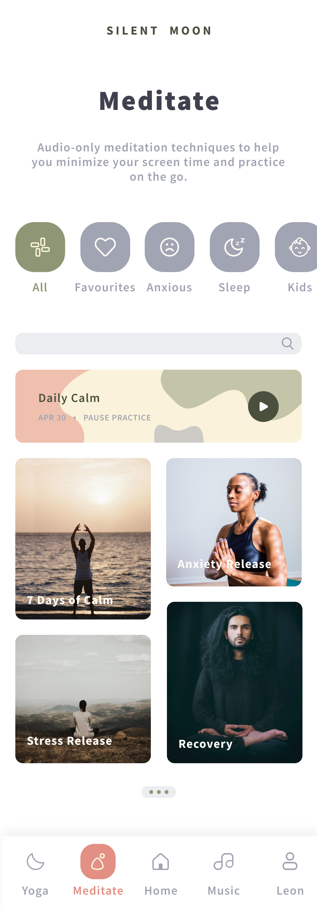

# Silent Moon

Silent Moon is a mobile web application for Yoga and Meditation. It provides yoga Workouts and meditation programs.
This app was created for mobile devices. 

After the registration and profile creation, it's possible to explore Yoga Workouts or Meditation Programms. 
The are different categories and Music Playlists, each Meditation Programm has its own Playlist, each yoga workout has its own video and there are many Live Search Possibilities.

 

## Technolgy Stack 

The technologies used for the creation of this app are: 
- HTML, JavaScript and CSS
- React.js
- Node.js 
- MongoDB
- Git
- Spotify API.

## Link to the Mobile App

here: [SilentMoon](https://silent-moon-client.herokuapp.com/) – Go to Silent Moon!

## Screenshots of the app

    
     
    
    
    
    
    

